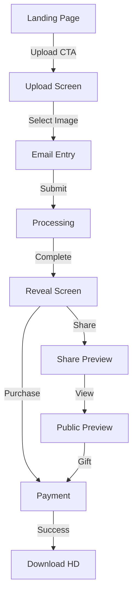
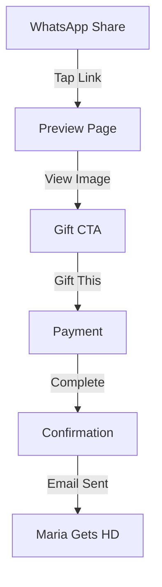

# UX Design Specification: 3d-ultra

**Version:** 1.0  
**Date:** 2024-12-20  
**Author:** UX Designer Agent  
**Status:** Complete

---

## Executive Summary

### Project Vision
3d-ultra transforms 4D ultrasound images into photorealistic "baby's first photo" using AI. The product creates an emotional, shareable moment for expecting parents.

### Target Users

**Maria (Primary):** 28, first-time mom, tech-savvy, shares everything on WhatsApp
- Emotional state: Excited, hopeful, slightly anxious
- Needs: Quick results, easy sharing, beautiful output

**Carlos (Secondary):** 55, soon-to-be grandfather, moderate tech skills
- Emotional state: Proud, wants to participate
- Needs: Simple flow, clear gift option

**Rosa (Tertiary):** 32, discovers via viral share
- Emotional state: Curious, "I want that too"
- Needs: Fast path from discovery to upload

### Key Design Challenges
1. **60-second wait:** Keep users engaged during processing
2. **Mobile upload:** Handle HEIC, large files, network issues
3. **Watermark balance:** Shareable but drives purchase
4. **Gift flow:** Clear for non-tech-savvy users

### Design Opportunities
1. **Emotional waiting:** Transform wait into anticipation
2. **Reveal animation:** Peak emotional moment
3. **Native share:** Leverage platform sharing
4. **Trust signals:** Address privacy concerns

---

## Core User Experience

### Core Action: THE REVEAL

The product's defining moment is when the AI-generated image is revealed. Everything builds to this:

```
Upload → Wait (anticipation builds) → REVEAL (emotional peak) → Share/Purchase
```

### Platform Strategy

**Mobile Web (PWA-ready)**
- Primary: Safari iOS, Chrome Android
- Secondary: Desktop browsers
- No native app initially (faster to market)

### Effortless Interactions

| Action | Taps Required |
|--------|---------------|
| Upload image | 2 (button + select) |
| Enter email | 1 (keyboard appears) |
| View result | 0 (auto-navigation) |
| Share to WhatsApp | 2 |
| Purchase (Apple Pay) | 2 |
| Download HD | 1 |

### Critical Success Moments
1. **First impression:** "This looks trustworthy and magical"
2. **Upload complete:** "It's working, I'm excited"
3. **The reveal:** "Oh my god, that's my baby"
4. **Share:** "Everyone needs to see this"
5. **Purchase:** "Worth every penny"

---

## Desired Emotional Response

### Emotional Journey Map

```
Curiosity → Hope → Anticipation → AWE → Joy → Pride → Connection → Purchase
    ↑         ↑         ↑          ↑      ↑      ↑         ↑           ↑
  Landing   Upload    Wait      Reveal  Share  Show     Gift      Download
                               (PEAK)         Others   Others
```

### Primary Emotions

| Emotion | When | Design Response |
|---------|------|-----------------|
| **Wonder** | Reveal | Blur-to-sharp animation, pause before UI |
| **Joy** | After reveal | Celebration (subtle confetti), warm copy |
| **Connection** | Sharing | Easy share to family groups |

### Supporting Emotions

| Emotion | When | Design Response |
|---------|------|-----------------|
| Curiosity | Landing | Compelling before/after examples |
| Trust | Upload | Privacy assurances, familiar UI |
| Anticipation | Wait | Engaging progress, hopeful copy |
| Pride | After share | Positive feedback on share |

### Emotions to Avoid

| Emotion | Trigger | Prevention |
|---------|---------|------------|
| Anxiety | Long wait | Show progress, estimated time |
| Confusion | Unclear next step | Single prominent CTA |
| Frustration | Errors | Graceful handling, warm copy |
| Disappointment | Poor quality | Quality checks, refund option |

### Emotional Design Principles

1. **Peak-End Rule:** Reveal is the peak, download is the end—both must be excellent
2. **Emotional Momentum:** Never let energy drop during the flow
3. **Vulnerability Requires Safety:** Parents are emotionally invested—be trustworthy
4. **Joy is Contagious:** The reveal should make them want to share immediately
5. **Surprise Creates Memory:** The animation should exceed expectations
6. **Uncertainty is the Enemy:** Always show what's happening and what's next

---

## UX Pattern Analysis & Inspiration

### Pregnancy App Patterns (What.to.Expect, Flo)

**Adopt:**
- Warm, reassuring color palette
- Milestone celebration moments
- Simple, focused task flows

**Avoid:**
- Information overload
- Medical anxiety triggers
- Complex onboarding

### AI Image Generation Patterns (Midjourney, DALL-E)

**Adopt:**
- Clear progress indicators
- Before/after comparisons
- Easy sharing mechanics

**Avoid:**
- Technical complexity
- Multiple option overload
- Subscription-first approach

### Emotional/Gift Experience Patterns (Unwrap, Celebration apps)

**Adopt:**
- Reveal animations
- Anticipation building
- Gift messaging

**Avoid:**
- Over-the-top animations
- Forced social actions
- Confusing gift flows

---

## Design System Foundation

### System Choice: shadcn/ui + Tailwind CSS

**Rationale:**
- Speed: Pre-built, accessible components
- Customization: Full control over styling
- React ecosystem: Works with TanStack Start
- Bundle size: Tree-shakeable, only import what's used

### Typography

**Font Stack:**
```css
--font-display: "Playfair Display", Georgia, serif;  /* Headlines */
--font-body: "DM Sans", system-ui, sans-serif;       /* Body text */
--font-mono: "JetBrains Mono", monospace;            /* Technical */
```

**Scale:**
```css
--text-xs: 12px;
--text-sm: 14px;
--text-base: 16px;
--text-lg: 18px;
--text-xl: 20px;
--text-2xl: 24px;
--text-3xl: 32px;
--text-4xl: 48px;
```

### Color System: Warm & Intimate

```css
/* Primary: Coral */
--color-primary: #E8927C;
--color-primary-hover: #D4806B;
--color-primary-light: #FEF3F0;

/* Neutral: Warm */
--color-cream: #FDF8F5;
--color-warm-gray: #8B7E74;
--color-charcoal: #2D2A26;

/* Accents */
--color-rose: #F5D0C5;
--color-gold: #C4A77D;

/* Semantic */
--color-success: #7DB88F;
--color-error: #D4574E;
```

**Contrast Ratios:**
- Charcoal on Cream: 12.6:1 ✅ AAA
- White on Coral: 4.1:1 ✅ AA
- Coral on Cream: 3.2:1 ✅ AA (large text)

### Spacing

```css
--space-1: 4px;
--space-2: 8px;
--space-3: 12px;
--space-4: 16px;
--space-5: 20px;
--space-6: 24px;
--space-8: 32px;
--space-10: 40px;
--space-12: 48px;
--space-16: 64px;
```

### Border Radius

```css
--radius-sm: 4px;
--radius-md: 8px;
--radius-lg: 12px;
--radius-xl: 16px;
--radius-full: 9999px;
```

### Shadows

```css
--shadow-sm: 0 1px 2px rgba(45, 42, 38, 0.05);
--shadow-md: 0 4px 6px rgba(45, 42, 38, 0.07);
--shadow-lg: 0 10px 15px rgba(45, 42, 38, 0.1);
--shadow-glow: 0 0 20px rgba(232, 146, 124, 0.3);
```

### Animations

```css
/* Transitions */
--transition-fast: 150ms ease;
--transition-normal: 300ms ease;
--transition-slow: 500ms ease;

/* Reveal Animation */
@keyframes reveal {
  from { filter: blur(20px); opacity: 0.7; }
  to { filter: blur(0); opacity: 1; }
}

/* Signature Glow (Button Hover) */
@keyframes signature-glow {
  0%, 100% { box-shadow: 0 0 20px rgba(232, 146, 124, 0.3); }
  50% { box-shadow: 0 0 30px rgba(232, 146, 124, 0.5); }
}
```

---

## Core Experience Mechanics

### Processing Wait Experience

**Duration:** 60-90 seconds

**3-Stage Progress:**

| Stage | Duration | Message | Visual |
|-------|----------|---------|--------|
| 1. Preparing | 0-20s | "Analyzing your ultrasound..." | Scan animation |
| 2. Creating | 20-60s | "Creating your baby's portrait..." | Particle effect |
| 3. Finishing | 60-90s | "Adding final touches..." | Polish animation |

**Engagement Elements:**
- Reassuring copy that changes
- Subtle background animation
- Progress percentage (when estimable)
- "Did you know?" baby facts

### Reveal Animation

**Sequence:**
1. Screen dims slightly (0.3s)
2. Image appears blurred (instant)
3. Blur slowly clears (2s ease-out)
4. Subtle zoom settle (0.5s)
5. Pause for emotional beat (1.5s)
6. UI fades in (0.5s)

```typescript
const RevealAnimation = {
  blur: { from: 20, to: 0, duration: 2000, easing: 'easeOutCubic' },
  scale: { from: 1.05, to: 1, duration: 2500, easing: 'easeOutCubic' },
  uiDelay: 3500, // Wait before showing buttons
};
```

### Share Flow

**Immediate Post-Reveal:**
1. "Share your baby's first photo"
2. WhatsApp button (primary)
3. Copy link button (secondary)
4. Native share fallback

**Watermark Strategy:**
- Position: Bottom-right corner
- Opacity: 40%
- Size: 15% of image width
- Text: "3d-ultra.com"

---

## User Journey Flows

### Self-Purchase Flow (Maria)



### Gift Purchase Flow (Carlos)



### Error Recovery

| Error | Response |
|-------|----------|
| Upload fails | "Let's try again" + retry button |
| Processing fails | "We couldn't process this image" + refund/retry |
| Payment fails | "Payment didn't go through" + retry + alternatives |
| Network lost | Session recovery on return |

---

## Component Strategy

### shadcn/ui Components (Customized)

| Component | Customization |
|-----------|---------------|
| Button | Coral primary, glow hover |
| Input | Cream background, warm focus |
| Dialog | Centered, overlay blur |
| Toast | Right side, warm colors |
| Progress | Coral fill, stage indicators |

### Custom Components (Build from Scratch)

#### 1. ImageUploader
- Drag-drop zone with camera roll fallback
- HEIC detection and conversion
- Client-side compression
- Progress with percentage

#### 2. ProcessingScreen
- 3-stage progress indicator
- Engaging wait messaging
- Background animation
- Timer/estimate display

#### 3. RevealAnimation
- Blur-to-sharp transition
- Zoom settle effect
- Delayed UI appearance
- Sound option (optional)

#### 4. BeforeAfterSlider
- Touch-friendly handle
- Smooth scrubbing
- Keyboard accessible

#### 5. ShareSheet
- Platform-aware buttons
- Watermarked preview
- Copy link feedback

#### 6. PaymentModal
- Apple Pay / Google Pay primary
- Card fallback
- Gift toggle

#### 7. DownloadButton
- Progress indicator
- Save to camera roll
- Re-download support

#### 8. GiftCard
- Preview image
- Gift message
- Purchase CTA

#### 9. TrustBadges
- Privacy assurance
- Secure payment
- Data deletion promise

---

## UX Consistency Patterns

### Button Hierarchy

| Type | Use | Style |
|------|-----|-------|
| Primary | Main CTA | Coral, glow hover |
| Secondary | Alternative action | Outlined |
| Ghost | Tertiary | Text only |
| Danger | Destructive | Red variant |

### Feedback Patterns

| Action | Feedback |
|--------|----------|
| Button click | Ripple + state change |
| Form submit | Loading spinner |
| Upload complete | ✨ + "Ready!" |
| Purchase complete | 🎉 + confetti |
| Error | 😕 + warm error message |

### Form Patterns

| Field | Behavior |
|-------|----------|
| Email | Validation on blur, real-time format check |
| Payment | Stripe Elements, Apple Pay priority |

### Loading States

| Context | Pattern |
|---------|---------|
| Page load | Skeleton shimmer |
| Button action | Spinner replaces text |
| Processing | Stage progress |
| Image load | Blur placeholder |

### Toast Notifications

| Type | Position | Duration |
|------|----------|----------|
| Success | Top-right | 3s |
| Error | Top-right | 5s |
| Info | Top-right | 4s |

### Micro-interactions

| Element | Interaction |
|---------|-------------|
| Upload zone | Pulse on drag over |
| Progress stages | Slide transition |
| Reveal | Blur-to-sharp + zoom |
| Share button | Ripple + glow |
| Purchase | Confetti on success |

---

## Responsive Design & Accessibility

### Responsive Strategy

**Mobile-First Philosophy:**

3d-ultra is designed mobile-first because:
- Primary action (sharing) happens on mobile
- WhatsApp/Messages are mobile apps
- Emotional moments captured on phones
- Upload often from phone camera roll

**Device Adaptations:**

| Device | Layout | Key Adaptations |
|--------|--------|-----------------|
| **Mobile (320-767px)** | Single column, full-width | Native feel, thumb-zone CTAs |
| **Tablet (768-1023px)** | Centered, 560px max | More breathing room |
| **Desktop (1024px+)** | Centered, 560px max | Same as tablet, larger images |

### Breakpoint Strategy

**Tailwind Breakpoints:**

```css
/* Default: Mobile (< 640px) */
.container { padding: 16px; }

/* sm: 640px+ */
@media (min-width: 640px) {
  .container { padding: 24px; max-width: 560px; margin: 0 auto; }
}
```

**Responsive Rules:**

| Element | Mobile | Tablet/Desktop |
|---------|--------|----------------|
| Container padding | 16px | 24px |
| Max content width | 100% | 560px |
| Button width | 100% | Auto (min 280px) |
| Font size (hero) | 32px | 48px |

### Accessibility Strategy

**Target: WCAG 2.1 Level AA**

**Color Contrast:**

| Combination | Ratio | Status |
|-------------|-------|--------|
| Charcoal on Cream | 12.6:1 | ✅ AAA |
| Coral on Cream | 3.2:1 | ✅ AA (large text) |
| White on Coral | 4.1:1 | ✅ AA |

**Touch Targets:**

```css
.interactive { min-height: 48px; min-width: 48px; }
.btn-primary { min-height: 56px; }
.btn-close { width: 44px; height: 44px; }
```

**Keyboard Navigation:**

| Action | Key |
|--------|-----|
| Navigate | Tab / Shift+Tab |
| Activate | Enter / Space |
| Close modal | Escape |
| Move slider | Arrow keys |

**Focus Management:**

```css
:focus-visible {
  outline: 3px solid var(--color-primary);
  outline-offset: 2px;
}
```

**Screen Reader Support:**

```html
<div aria-live="polite" class="sr-only">{statusMessage}</div>
<button aria-label="Upload your 4D ultrasound image">Upload</button>

```

**Reduced Motion:**

```css
@media (prefers-reduced-motion: reduce) {
  *, *::before, *::after {
    animation-duration: 0.01ms !important;
    transition-duration: 0.01ms !important;
  }
}
```

### Testing Strategy

**Device Test Matrix:**

| Device | Screen | Priority |
|--------|--------|----------|
| iPhone SE | 375px | High |
| iPhone 14 | 390px | High |
| Samsung Galaxy | 360px | High |
| iPad | 768px | Medium |
| Desktop | 1440px | Low |

**Accessibility Testing:**

| Tool | When |
|------|------|
| axe DevTools | Every PR |
| Lighthouse | Every PR |
| VoiceOver | Before launch |
| Keyboard-only | Every feature |

### Implementation Guidelines

**Responsive:**

```typescript
<Button className="w-full sm:w-auto sm:min-w-[280px]">
  Upload Your Ultrasound
</Button>

<div className="px-4 sm:px-6 sm:max-w-[560px] sm:mx-auto">
  {children}
</div>
```

**Accessibility:**

```typescript
// Skip link
<a href="#main-content" className="sr-only focus:not-sr-only">
  Skip to main content
</a>

// Main content
<main id="main-content" tabIndex={-1}>
  {content}
</main>
```

**Component A11y Checklist:**

| Component | Required |
|-----------|----------|
| Button | `aria-label` if icon-only |
| Input | `aria-describedby`, `aria-invalid` |
| Modal | Focus trap, `aria-modal`, Escape closes |
| Toast | `role="alert"`, `aria-live` |
| Image | Descriptive `alt` text |

---

## Implementation Notes

### Priority Order

1. **Landing page** - First impression
2. **Upload flow** - Core functionality
3. **Processing screen** - Keep users engaged
4. **Reveal animation** - Emotional peak (critical!)
5. **Payment flow** - Monetization
6. **Share flow** - Viral growth
7. **Polish & accessibility** - Quality

### Key Technical Decisions

- Use CSS animations over JS where possible (performance)
- Preload/prefetch result image during processing
- Use Web Share API with fallbacks
- Implement session recovery for mobile backgrounding
- Cache aggressively for repeat visits

### Copy Tone

| Context | Tone |
|---------|------|
| Landing | Warm, magical, inviting |
| Upload | Reassuring, simple |
| Processing | Hopeful, engaging |
| Reveal | Minimal (let image speak) |
| Purchase | Clear value, no pressure |
| Error | Empathetic, helpful |

---

## Appendix: Design Direction

### Selected Direction: Warm & Intimate

**Characteristics:**
- Cream background (#FDF8F5)
- Coral primary (#E8927C)
- Serif headlines (Playfair Display)
- Sans-serif body (DM Sans)
- Soft shadows, warm tones
- Gentle animations

**Why This Direction:**
- Matches emotional nature of product
- Appeals to expecting parents
- Differentiates from clinical/tech aesthetic
- Supports trust and warmth

---

*UX Design Specification Complete. Ready for Architecture and Development.*
